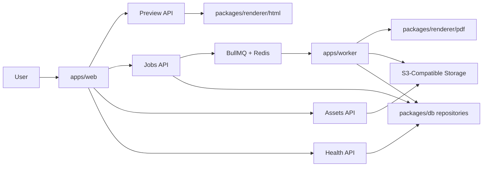

# md2pdf

Production-grade Markdown-to-PDF platform built as a monorepo.

It preserves the visual rendering style of the original script, including Mermaid diagram support, while moving the system into a full-stack architecture with:

- a Next.js web app
- a shared renderer package split into HTML and PDF entrypoints
- a BullMQ worker
- PostgreSQL for metadata
- Redis for queueing
- S3-compatible storage for temporary assets and PDFs
- `pnpm` workspaces with Turborepo orchestration

## What This Project Does

The platform lets authenticated users:

- write Markdown in a browser editor
- upload assets and reference them with `asset://<id>`
- preview rendered output
- export Markdown to PDF through an asynchronous worker
- download completed PDFs

The renderer is designed to preserve the original output contract:

- print-first layout
- Mermaid diagrams rendered to SVG
- styled sheet layout
- tall single-page PDF output

## Monorepo Layout

```text
md2pdf/
├─ apps/
│  ├─ cli/              # Local offline CLI + Ink studio + packaging scripts
│  ├─ web/              # Next.js app, auth, editor UI, API routes
│  └─ worker/           # Queue consumer, healthcheck, cleanup, PDF rendering
├─ packages/
│  ├─ cli-core          # Shared local workspace, assets, history, theme/runtime
│  ├─ core/             # Shared env, queue, logging, schemas, storage helpers
│  ├─ db/               # Prisma schema plus repository/service layer
│  └─ renderer/         # Shared HTML renderer + Playwright PDF renderer
├─ scripts/             # CLI compatibility path and local helper scripts
├─ docs/
│  └─ architecture-guide.md
├─ pnpm-workspace.yaml  # pnpm workspace definition
├─ turbo.json           # Turborepo task graph
├─ docker-compose.yml   # Local infrastructure
├─ package.json         # Root pnpm + turbo scripts
└─ tsconfig.base.json   # Shared TypeScript config
```

## Key Architecture



For the full architecture walkthrough, see [docs/architecture-guide.md](C:/dev/md2pdf/docs/architecture-guide.md).

## Core Packages And Apps

### `apps/web`

Contains:

- login/register UI
- dashboard editor
- preview integration
- asset upload route
- job submission and polling routes
- PDF download route
- health endpoint

### `apps/cli`

Contains:

- local offline `md2pdf` command surface
- full-screen Ink-based `md2pdf studio`
- preview, validation, asset import, and PDF export commands
- current-platform SEA packaging flow for standalone releases

### `packages/cli-core`

Contains:

- `.md2pdf/` workspace config and history handling
- managed asset import and `asset://` mapping for offline use
- relative and absolute local image resolution
- theme resolution and JSON export helpers
- shared preview/export orchestration for the CLI and compatibility script

The web app only uses the HTML renderer path. It does not import Playwright-backed PDF code.

### `apps/worker`

Contains:

- BullMQ worker
- worker healthcheck
- render job execution
- retry classification
- PDF upload logic
- job status updates
- stale-job recovery
- periodic cleanup for expired assets and PDFs

The worker is the only process that imports the PDF renderer path.

### `packages/renderer`

Contains:

- Markdown validation
- `asset://` rewrite logic
- HTML document generation
- Mermaid runtime
- Playwright PDF export

Public entrypoints:

- `@md2pdf/renderer/html`
- `@md2pdf/renderer/pdf`

This is the most important package in the repo because it preserves the actual rendering behavior.

### `packages/core`

Contains:

- environment parsing
- queue helpers
- structured logging helpers
- shared schemas
- storage helpers

### `packages/db`

Contains:

- Prisma schema
- migrations
- generated Prisma client
- repository/service APIs for users, assets, and jobs

## Local Development

### Prerequisites

- Node.js 22+
- pnpm 10+
- Docker

### Start Local Infrastructure

```bash
docker compose up -d postgres redis minio minio-setup
```

### Install Dependencies

```bash
corepack enable
pnpm install
```

### Generate Prisma Client

```bash
pnpm db:generate
```

### Run Database Migration

```bash
pnpm db:migrate
```

### Start The Web App

```bash
pnpm dev:web
```

### Start The Worker

```bash
pnpm dev:worker
```

## Build And Test

### Build Everything

```bash
pnpm build
```

### Run Tests

```bash
pnpm test
```

### Run Type Checks

```bash
pnpm typecheck
```

### Run The Smoke Check

```bash
pnpm smoke
```

## Local CLI

The repo now includes a full local/offline CLI in `apps/cli`.

Primary commands:

```bash
node apps/cli/dist/index.mjs render input.md
node apps/cli/dist/index.mjs preview input.md --watch
node apps/cli/dist/index.mjs validate input.md
node apps/cli/dist/index.mjs studio input.md
node apps/cli/dist/index.mjs assets import ./logo.png
node apps/cli/dist/index.mjs themes export
node apps/cli/dist/index.mjs setup
```

Key behavior:

- works fully offline
- supports both managed `asset://<id>` images and relative local image paths
- stores local state in `.md2pdf/`
- opens visual preview in the system browser rather than trying to rasterize PDF inside the terminal
- degrades gracefully when the OS launcher is blocked by showing the path/URL to open manually instead of crashing

The original script workflow is still preserved through the compatibility wrapper in `scripts/`.

Example:

```bash
node scripts/render-markdown-pdf.mjs input.md output.pdf
```

That wrapper now uses the same shared local runtime as the new CLI.

## CLI Packaging

For the npm/developer path:

```bash
pnpm --filter md2pdf build
node apps/cli/dist/index.mjs --help
node apps/cli/dist/index.mjs setup
```

For the standalone current-platform package path:

```bash
pnpm --filter md2pdf package
apps/cli/dist/release/md2pdf.exe --help
```

Notes:

- the packaged release is OS-specific
- Chromium can be installed on demand with `md2pdf setup`
- the CLI resolves the Playwright installer from the local `playwright` package and no longer depends on a non-exported subpath
- if `preview`, `studio`, or `render --open` cannot launch a browser/PDF viewer in the current environment, the CLI will print the target path or URL so it can be opened manually
- Linux users may still need browser system libraries depending on their target environment

## Environment Variables

See:

- `.env.example`

Important values include:

- `DATABASE_URL`
- `REDIS_URL`
- `S3_ENDPOINT`
- `S3_BUCKET`
- `S3_PUBLIC_BASE_URL`
- `AUTH_COOKIE_SECRET`
- `APP_URL`
- `RENDER_TIMEOUT_MS`
- `MAX_MARKDOWN_BYTES`
- `MAX_ASSET_BYTES`
- `MAX_ASSET_COUNT`
- `MAX_CONCURRENT_JOBS_PER_USER`
- `WORKER_CONCURRENCY`
- `JOB_MAX_ATTEMPTS`
- `JOB_BACKOFF_MS`
- `ASSET_TTL_HOURS`
- `JOB_TTL_HOURS`

## Security Model

Current v1 rules:

- login required for rendering workflows
- raw HTML disabled in Markdown
- uploaded assets only
- no arbitrary remote image URLs
- per-user concurrency limits
- size and timeout limits
- temporary asset and PDF retention

## Deployment

The repo includes container definitions for:

- web app
- worker
- PostgreSQL
- Redis
- MinIO

Main files:

- [docker-compose.yml](C:/dev/md2pdf/docker-compose.yml)
- [apps/web/Dockerfile](C:/dev/md2pdf/apps/web/Dockerfile)
- [apps/worker/Dockerfile](C:/dev/md2pdf/apps/worker/Dockerfile)

Container split:

- web builds on a slim Node image
- worker builds on the Playwright image
- both Dockerfiles use Turborepo pruning and pnpm installs

## Current Status

Implemented:

- pnpm workspace + Turborepo foundation
- shared renderer package
- renderer HTML/PDF boundary split
- auth flow
- editor and preview UI
- asset uploads
- queued PDF export
- worker processing
- worker cleanup and stale-job recovery
- health endpoints/checks
- DB repository layer
- storage integration
- local infrastructure setup

Not yet deeply implemented:

- full visual regression suite
- richer production observability beyond structured logs
- hardened auth provider integration
- aggressive abuse/rate-limiting controls

## Documentation

- Detailed architecture: [docs/architecture-guide.md](C:/dev/md2pdf/docs/architecture-guide.md)
