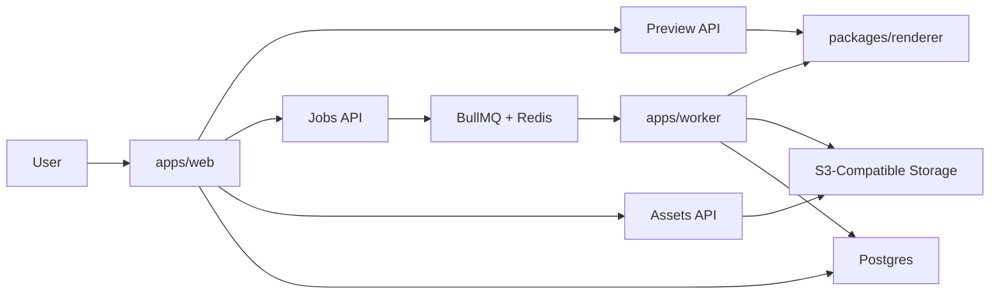

# md2pdf

Production-grade Markdown-to-PDF platform built as a monorepo.

It preserves the visual rendering style of the original script, including Mermaid diagram support, while moving the system into a full-stack architecture with:

- a Next.js web app
- a shared renderer package
- a BullMQ worker
- PostgreSQL for metadata
- Redis for queueing
- S3-compatible storage for temporary assets and PDFs

## What This Project Does

The platform lets authenticated users:

- write Markdown in a browser editor
- upload assets and reference them with `asset://<id>`
- preview rendered output
- export Markdown to PDF through an asynchronous worker
- download completed PDFs

The renderer is designed to preserve the original output contract:

- print-first layout
- Mermaid diagrams rendered to SVG
- styled sheet layout
- tall single-page PDF output

## Monorepo Layout

```text
md2pdf/
├─ apps/
│  ├─ web/              # Next.js app, auth, editor UI, API routes
│  └─ worker/           # Queue consumer and PDF rendering worker
├─ packages/
│  ├─ core/             # Shared env, queue, schemas, storage helpers
│  ├─ db/               # Prisma schema, migration, generated client
│  └─ renderer/         # Shared Markdown/Mermaid/Playwright renderer
├─ scripts/             # CLI compatibility path and local helper scripts
├─ docs/
│  └─ architecture-guide.md
├─ docker-compose.yml   # Local infrastructure
├─ package.json         # Root workspace scripts
└─ tsconfig.base.json   # Shared TypeScript config
```

## Key Architecture



For the full architecture walkthrough, see [docs/architecture-guide.md](C:/dev/md2pdf/docs/architecture-guide.md).

## Core Packages And Apps

### `apps/web`

Contains:

- login/register UI
- dashboard editor
- preview integration
- asset upload route
- job submission and polling routes
- PDF download route

### `apps/worker`

Contains:

- BullMQ worker
- render job execution
- PDF upload logic
- job status updates
- periodic cleanup for expired assets and PDFs

### `packages/renderer`

Contains:

- Markdown validation
- `asset://` rewrite logic
- HTML document generation
- Mermaid runtime
- Playwright PDF export

This is the most important package in the repo because it preserves the actual rendering behavior.

### `packages/core`

Contains:

- environment parsing
- queue helpers
- shared schemas
- storage helpers

### `packages/db`

Contains:

- Prisma schema
- migrations
- generated Prisma client
- database client singleton

## Local Development

### Prerequisites

- Node.js 22+
- npm 11+
- Docker

### Start Local Infrastructure

```bash
docker compose up -d postgres redis minio minio-setup
```

### Install Dependencies

```bash
npm install
```

### Generate Prisma Client

```bash
npm run db:generate
```

### Run Database Migration

```bash
npm run db:migrate
```

### Start The Web App

```bash
npm run dev:web
```

### Start The Worker

```bash
npm run dev:worker
```

## Build And Test

### Build Everything

```bash
npm run build
```

### Run Tests

```bash
npm run test
```

## CLI Compatibility

The original script workflow is preserved through the compatibility wrapper in `scripts/`.

Example:

```bash
node scripts/render-markdown-pdf.mjs input.md output.pdf
```

This now delegates to the shared renderer package instead of using the old direct browser-spawn script.

## Environment Variables

See:

- `.env.example`

Important values include:

- `DATABASE_URL`
- `REDIS_URL`
- `S3_ENDPOINT`
- `S3_BUCKET`
- `S3_PUBLIC_BASE_URL`
- `AUTH_COOKIE_SECRET`
- `APP_URL`
- `RENDER_TIMEOUT_MS`
- `MAX_MARKDOWN_BYTES`
- `MAX_ASSET_BYTES`
- `MAX_ASSET_COUNT`
- `MAX_CONCURRENT_JOBS_PER_USER`

## Security Model

Current v1 rules:

- login required for rendering workflows
- raw HTML disabled in Markdown
- uploaded assets only
- no arbitrary remote image URLs
- per-user concurrency limits
- size and timeout limits
- temporary asset and PDF retention

## Deployment

The repo includes container definitions for:

- web app
- worker
- PostgreSQL
- Redis
- MinIO

Main files:

- [docker-compose.yml](C:/dev/md2pdf/docker-compose.yml)
- [apps/web/Dockerfile](C:/dev/md2pdf/apps/web/Dockerfile)
- [apps/worker/Dockerfile](C:/dev/md2pdf/apps/worker/Dockerfile)

## Current Status

Implemented:

- monorepo foundation
- shared renderer package
- auth flow
- editor and preview UI
- asset uploads
- queued PDF export
- worker processing
- storage integration
- local infrastructure setup

Not yet deeply implemented:

- full visual regression suite
- advanced production observability
- hardened auth provider integration
- aggressive abuse/rate-limiting controls

## Documentation

- Detailed architecture: [docs/architecture-guide.md](C:/dev/md2pdf/docs/architecture-guide.md)
