# md2pdf Platform Architecture Guide

## 1. Purpose

This project is a monorepo for a production-grade Markdown-to-PDF platform that preserves the visual fidelity of the original local script while upgrading the runtime into a web application with:

- an authenticated web UI
- a shared renderer package
- an asynchronous worker
- temporary asset storage
- temporary PDF storage
- queue-backed rendering
- a PostgreSQL-backed data model

The highest-priority architectural rule is:

> Preserve the current render contract as closely as possible while replacing brittle local-machine assumptions with production-safe service boundaries.

That means the renderer is not treated as a generic conversion utility. It is treated as a product surface with a specific visual identity and output model.

## 2. Architecture At A Glance

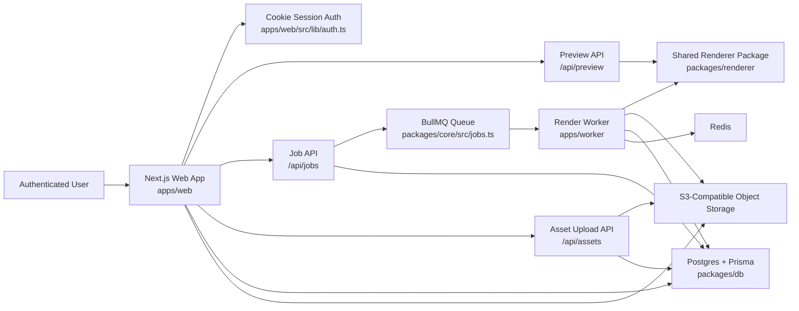

## 3. Design Goals

### 3.1 Primary Goals

1. Preserve PDF appearance from the original script.
2. Preserve Mermaid diagram rendering.
3. Replace local file-path assumptions with service-grade interfaces.
4. Allow public authenticated usage with explicit safety limits.
5. Keep documents and outputs temporary in v1.

### 3.2 Non-Goals For The Current Version

The current implementation does not attempt to be:

- a collaborative editor
- a long-term document management system
- a multi-template publishing platform
- a raw-HTML-compatible Markdown renderer
- a serverless-first rendering system

## 4. Monorepo Structure

```text
md2pdf/
├─ apps/
│  ├─ web/              # Next.js frontend + API routes
│  └─ worker/           # Queue consumer + PDF rendering jobs
├─ packages/
│  ├─ core/             # Shared env, queue, schema, storage helpers
│  ├─ db/               # Prisma schema, migration, client
│  └─ renderer/         # Shared render engine used by preview + worker + CLI
├─ scripts/             # Compatibility CLI and local helper scripts
├─ docker-compose.yml   # Local infra topology
├─ package.json         # Root workspace scripts
└─ tsconfig.base.json   # Shared TS config
```

## 5. High-Level Component Model

### 5.1 Web App

Location:

- `apps/web`

Responsibilities:

- user authentication
- editor UI
- live preview
- asset upload
- render job submission
- job status polling
- PDF download

The web app is both:

- the browser-facing frontend
- the HTTP API layer for user actions

This is intentionally simple for v1. There is no separate dedicated API app yet.

### 5.2 Worker

Location:

- `apps/worker`

Responsibilities:

- consume render jobs from Redis/BullMQ
- fetch job data from Postgres
- resolve asset URLs
- call the shared renderer package
- upload the finished PDF
- update job status
- clean up expired artifacts

The worker is the only component that should perform final PDF generation for production exports.

### 5.3 Renderer Package

Location:

- `packages/renderer`

Responsibilities:

- validate Markdown input
- reject unsupported content
- rewrite `asset://` references
- generate a full HTML render document
- run the browser runtime for Markdown + Mermaid rendering
- export HTML to PDF with Playwright

This package is the core product asset of the system.

### 5.4 Core Package

Location:

- `packages/core`

Responsibilities:

- environment parsing
- shared schemas
- queue helpers
- S3-compatible storage helpers

This package exists so the web app and worker can share contracts without duplicating infrastructure code.

### 5.5 Database Package

Location:

- `packages/db`

Responsibilities:

- Prisma schema
- generated Prisma client
- DB connection singleton
- migration history

## 6. Detailed Runtime Topology

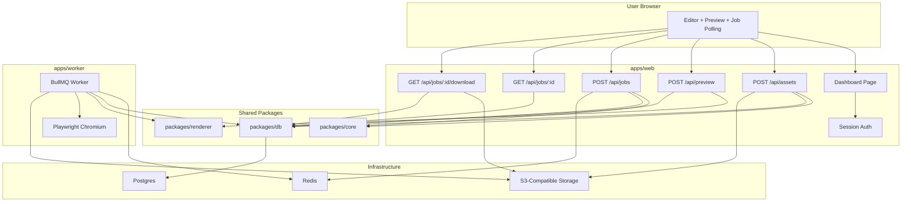

## 7. Rendering Contract

### 7.1 What Is Preserved

The renderer is intentionally built around the old rendering behavior:

- `marked` for Markdown parsing
- Mermaid code block detection from `pre > code.language-mermaid`
- Mermaid block replacement with rendered SVG
- single-sheet visual composition
- dynamic tall-page PDF sizing
- strong code/table/blockquote visual styling
- print-first output rather than web-page-first output

### 7.2 What Changed

The following implementation details changed to make the renderer service-grade:

- browser execution is now Playwright-based instead of ad hoc Chrome spawning
- the browser runtime is vendored locally, not CDN-fetched
- fonts are embedded into the render document
- validation happens before production job execution
- unsupported raw HTML is blocked
- assets must be uploaded and referenced by `asset://<id>`

### 7.3 Why The Shared Renderer Matters

The same renderer package is used by:

- preview generation in the web app
- final PDF generation in the worker
- the compatibility CLI script

This prevents drift between:

- what the user sees in preview
- what the worker renders in PDF
- what local script users get through the compatibility path

## 8. Renderer Internals

### 8.1 File Map

- `packages/renderer/src/render.ts`
  Public entry points.
- `packages/renderer/src/markdown.ts`
  Markdown validation and `marked` configuration.
- `packages/renderer/src/assets.ts`
  `asset://` rewrite logic.
- `packages/renderer/src/template.ts`
  Full HTML document generation.
- `packages/renderer/src/browser-runtime-source.ts`
  Browser-side Mermaid + Markdown runtime.
- `packages/renderer/src/runtime.ts`
  Loads vendored JS/font assets and builds the browser runtime payload.
- `packages/renderer/src/pdf.ts`
  Playwright browser lifecycle and PDF export.

### 8.2 Render Pipeline

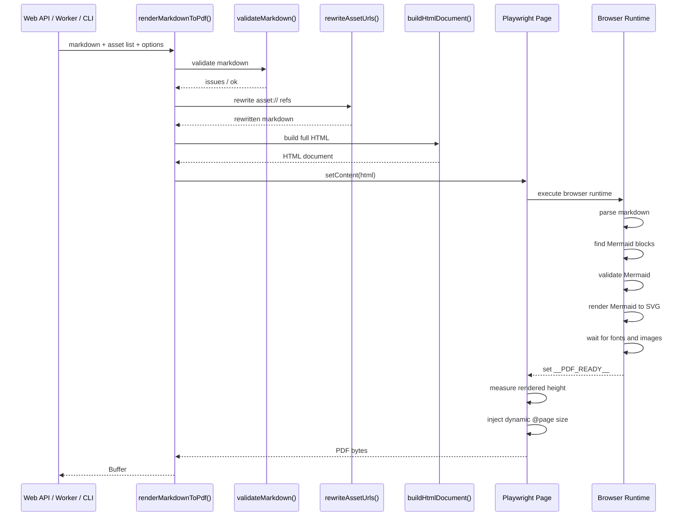

### 8.3 Browser Runtime Responsibilities

The browser runtime does the visual work because Mermaid rendering and final layout fidelity belong in a real browser context.

Responsibilities:

- parse Markdown into HTML
- locate Mermaid fenced code blocks
- validate each Mermaid definition early
- render Mermaid into SVG
- replace original code blocks with styled Mermaid cards
- wait for fonts
- wait for images
- signal ready or signal structured error

### 8.4 PDF Sizing Strategy

The project intentionally preserves a tall-page strategy instead of normal pagination.

The flow is:

1. Render all HTML.
2. Wait for diagrams, fonts, and images.
3. Measure total content height.
4. Convert the measured height to inches.
5. Inject a dynamic `@page` rule.
6. Export the PDF with `preferCSSPageSize: true`.

This is important because it keeps output close to the original script behavior.

## 9. Web Application Architecture

### 9.1 Route Model

Main pages:

- `/`
  Redirects to login or dashboard.
- `/login`
  Sign-in page.
- `/register`
  Registration page.
- `/dashboard`
  Main editor and job console.

Main APIs:

- `POST /api/auth/register`
- `POST /api/auth/login`
- `POST /api/auth/logout`
- `POST /api/assets`
- `POST /api/preview`
- `POST /api/jobs`
- `GET /api/jobs/:id`
- `GET /api/jobs/:id/download`

### 9.2 Page Composition

The dashboard is a single integrated workspace composed of:

- Markdown editor
- asset token side panel
- validation panel
- live preview frame
- recent job list

This is intentionally optimized for a render-centric workflow rather than a generic content-management workflow.

### 9.3 UI Flow

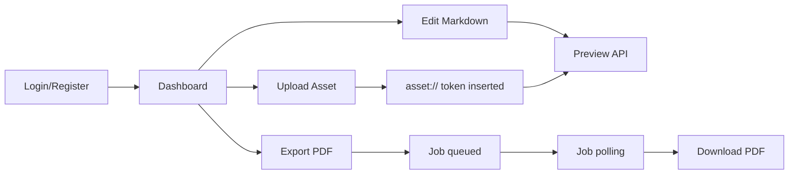

### 9.4 Preview Strategy

Preview is server-backed, not purely client-side.

That matters because:

- validation happens on the server
- asset ownership is enforced on the server
- preview uses the same shared renderer package as production rendering

The preview endpoint returns:

- HTML document when validation succeeds
- validation issues when input is not acceptable

The dashboard displays preview via `iframe srcDoc`, which isolates the renderer document from the app shell.

## 10. Authentication Architecture

### 10.1 Current Model

Authentication is cookie-session-based with JWT payloads signed using `jose`.

Key file:

- `apps/web/src/lib/auth.ts`

Flow:

1. User submits email/password.
2. Password is hashed and checked with `bcryptjs`.
3. Server issues a signed cookie.
4. Subsequent requests resolve the current user from the cookie.

### 10.2 Why This Is Acceptable For v1

The current auth model is simple and sufficient for:

- a self-hosted product
- an internal or controlled public launch
- a platform where the main security risk lives in rendering isolation and storage scoping

### 10.3 Future Upgrade Paths

The architecture can later move to:

- Auth.js
- OAuth providers
- password reset flows
- email verification
- session revocation tables

without changing the renderer contract.

## 11. Data Model

### 11.1 Entities

The schema currently contains three main entities:

- `User`
- `Asset`
- `Job`

### 11.2 Entity Relationships

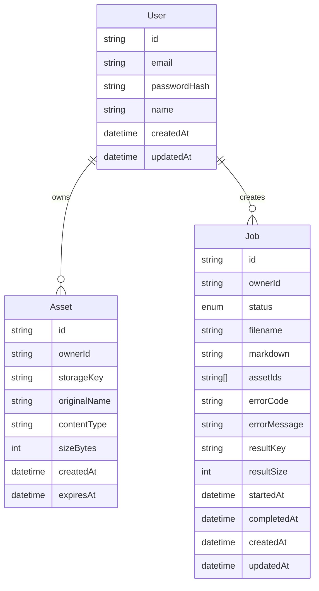

### 11.3 Design Observations

This schema favors operational simplicity over normalization.

Notable tradeoffs:

- `Job.assetIds` is stored as an array instead of a join table.
  This is simpler for v1 because jobs are immutable render requests.
- `markdown` is stored directly on the job.
  This makes job reprocessing and failure diagnosis easier.
- assets and results are temporary, so the data model does not attempt to be a permanent document store.

## 12. Queue And Worker Model

### 12.1 Queue Technology

BullMQ is used with Redis.

Shared queue configuration lives in:

- `packages/core/src/jobs.ts`

### 12.2 Why Queueing Exists

PDF rendering is not a good fit for synchronous request handling because it is:

- CPU-heavy
- browser-heavy
- latency-variable
- failure-prone under malformed diagrams or large assets

By queueing render jobs:

- the web layer stays responsive
- render concurrency is controlled
- retries and status updates become explicit

### 12.3 Worker Job Lifecycle

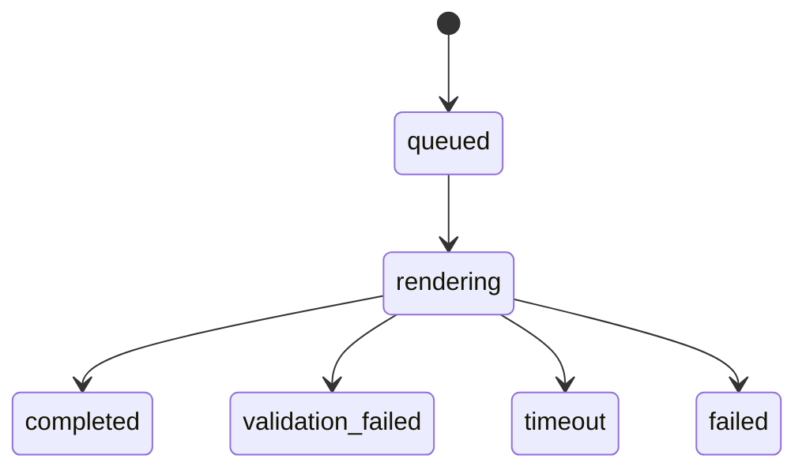

### 12.4 Worker Execution Flow

1. Worker receives a queue payload with `jobId`.
2. Worker fetches the job from Postgres.
3. Worker marks job as `rendering`.
4. Worker fetches owned assets for the job.
5. Worker calls the shared renderer.
6. Worker uploads the resulting PDF.
7. Worker marks the job as `completed`.
8. If errors occur, worker maps them to structured failure states.

### 12.5 Cleanup Loop

The worker also runs periodic cleanup to remove:

- expired uploaded assets
- expired generated PDFs
- completed/failed jobs older than the retention window

This reinforces the v1 decision that storage is temporary.

## 13. Asset Storage Architecture

### 13.1 Why `asset://` Exists

The system intentionally does not allow arbitrary image URLs.

Instead, users upload assets and refer to them as:

```md

```

The renderer then rewrites those references to approved storage URLs.

Benefits:

- predictable asset ownership
- no arbitrary remote fetches
- no local file path access
- lower SSRF risk
- easier expiry cleanup

### 13.2 Storage Pattern

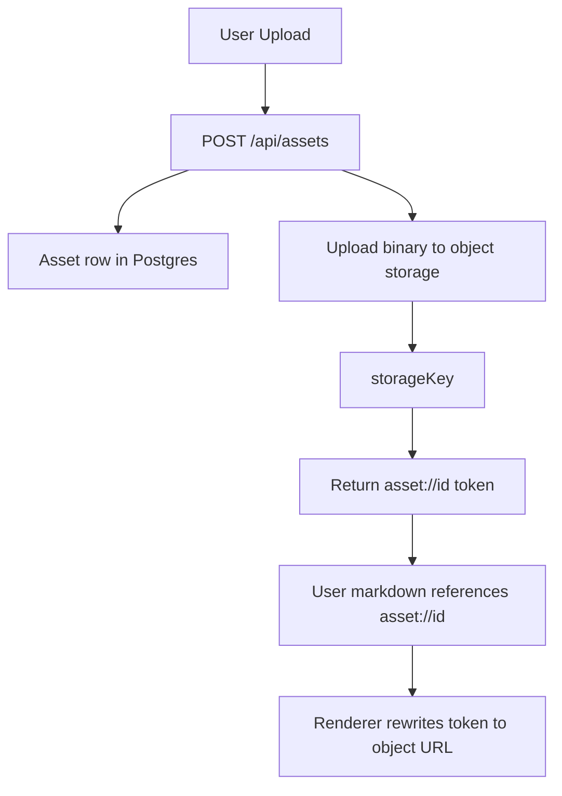

### 13.3 Current Assumption

Object storage is configured as S3-compatible and can be backed by:

- MinIO locally
- AWS S3 in production
- any compatible S3 service

## 14. Security Architecture

### 14.1 Current Defenses

The current code applies several important controls:

- all important routes require an authenticated user
- raw HTML is rejected during Markdown validation
- only uploaded assets are supported
- asset ownership is enforced server-side
- Markdown size is capped
- asset size and count are capped
- concurrent jobs per user are capped
- render timeout is capped

### 14.2 Threat Model Highlights

The biggest risks in a renderer service are:

- malicious or malformed Markdown
- hostile Mermaid payloads
- arbitrary asset fetches
- resource exhaustion
- browser sandbox misuse

### 14.3 Current Residual Risks

Areas that are acceptable for now but should be strengthened later:

- auth is custom and intentionally lightweight
- no explicit per-IP rate limiter is implemented yet
- no CAPTCHA or anti-abuse control exists yet
- Mermaid complexity limits are not yet deeply enforced
- a single worker process is still a relatively small isolation boundary

### 14.4 Future Security Hardening

Recommended next upgrades:

- dedicated rate limiting middleware
- audit logging for auth and job creation
- worker isolation at the process or container-per-job layer for untrusted public scale
- deeper Markdown and Mermaid complexity analysis
- stronger session and credential lifecycle management

## 15. Deployment Architecture

### 15.1 Local Compose Topology

The repository includes `docker-compose.yml` for local platform startup.

Services:

- `postgres`
- `redis`
- `minio`
- `minio-setup`
- `web`
- `worker`

### 15.2 Deployment Diagram

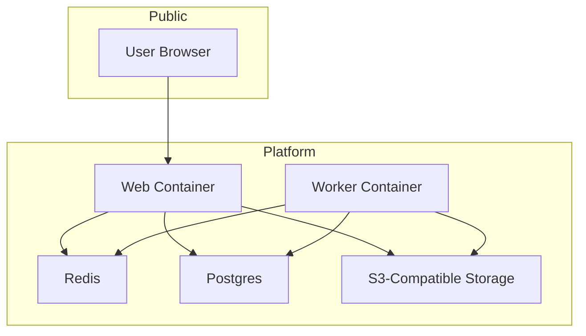

### 15.3 Why Linux Containers

The current architecture standardizes on Linux containers because:

- Playwright is easier to operate predictably there
- the worker and browser runtime are easier to package
- Chrome path discovery hacks are eliminated
- production and local environments can be made more similar

## 16. Build And Dependency Model

### 16.1 Workspace Behavior

The root `package.json` is the workspace orchestrator.

Shared scripts:

- `npm run build`
- `npm run test`
- `npm run db:generate`
- `npm run db:migrate`
- `npm run dev:web`
- `npm run dev:worker`

### 16.2 Why The Renderer Is A Package

If the renderer lived only inside the web app:

- the worker would duplicate logic
- the CLI compatibility path would drift
- preview and export would slowly diverge

Making it a package forces render logic to be reusable and explicit.

## 17. Request Flows

### 17.1 Login Flow

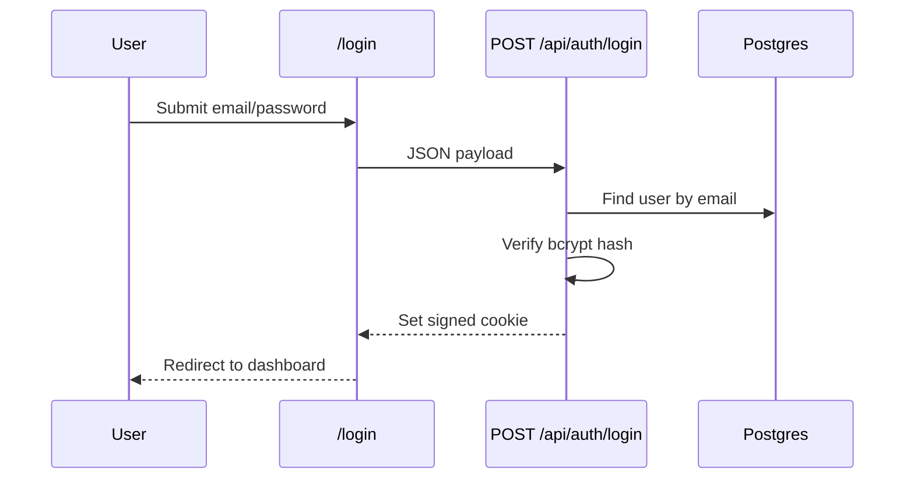

### 17.2 Asset Upload Flow

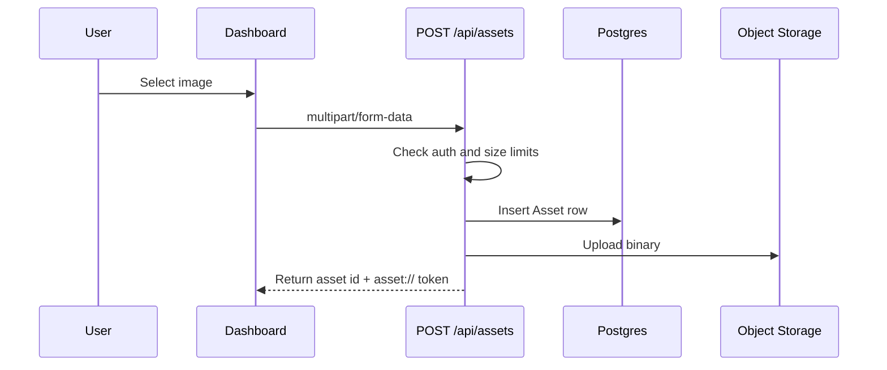

### 17.3 Preview Flow

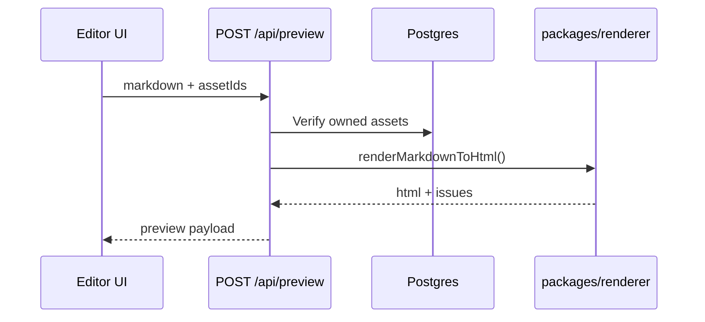

### 17.4 Export Flow

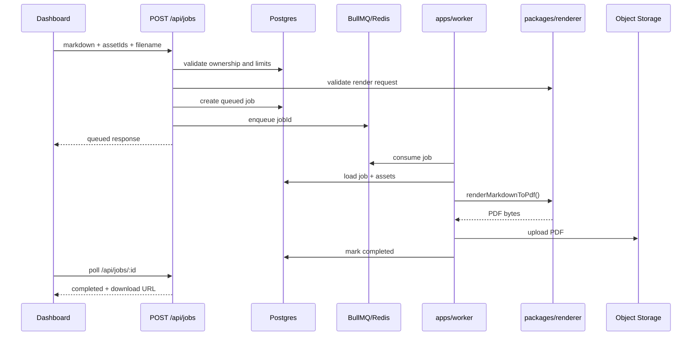

## 18. Operational Concerns

### 18.1 Observability Gaps

The current implementation is functional, but not yet deeply observable.

Recommended additions:

- structured logging
- request IDs
- job IDs in all logs
- queue timing metrics
- renderer timing metrics
- browser crash telemetry
- storage failure metrics

### 18.2 Scaling Model

Likely scale path:

1. One web instance, one worker instance.
2. Multiple web instances behind a load balancer.
3. Multiple worker instances sharing the same Redis and Postgres.
4. Separate queue types if preview or export traffic grows independently.

### 18.3 Bottlenecks

Expected bottlenecks at scale:

- Chromium concurrency in workers
- large asset upload throughput
- object storage latency
- Postgres growth from retained job rows
- Redis queue depth under burst load

## 19. Development Workflow

### 19.1 Recommended Local Startup

1. Start infrastructure.
2. Generate Prisma client.
3. Run DB migration.
4. Start web app.
5. Start worker.

Example:

```bash
docker compose up -d postgres redis minio minio-setup
npm run db:generate
npm run db:migrate
npm run dev:web
npm run dev:worker
```

### 19.2 Compatibility CLI

The original script workflow is preserved via:

- `scripts/render-markdown-pdf.mjs`
- `scripts/render-markdown-pdf.ts`

This is useful for:

- quick render checks
- visual regression corpus generation
- debugging renderer changes without running the full app

## 20. Architectural Strengths

This architecture has several strong properties:

- render logic is centralized
- preview and final export share the same renderer core
- browser rendering is standardized on Playwright Chromium
- web and worker responsibilities are cleanly separated
- storage and queueing are explicit service boundaries
- the repo is organized for incremental hardening rather than one-off scripting

## 21. Current Architectural Weaknesses

This guide should also be explicit about present weaknesses:

- the current session system is intentionally simple
- the web app still handles both UI and API concerns in one deployable
- preview is synchronous and can become expensive under load
- there are limited tests around visual regression today
- the worker cleanup policy is simple and time-based
- retention rules are not yet configurable per tenant or environment

## 22. Recommended Next Architectural Improvements

### 22.1 Short-Term

- add visual regression fixtures and golden PDF comparisons
- add API integration tests for auth, upload, preview, and jobs
- add rate limiting
- add request/job structured logs
- add a production `.env` contract document

### 22.2 Medium-Term

- move auth to a hardened provider model
- add job retries with clearer failure classification
- add browser crash recovery metrics
- add explicit storage lifecycle policies
- split preview and export quotas if needed

### 22.3 Long-Term

- support multiple output templates
- support durable saved documents if product scope expands
- add multi-tenant isolation if this becomes a shared SaaS
- isolate render jobs more aggressively if anonymous/public scale is required

## 23. Summary

The system is best understood as a render-centric platform with four layers:

1. `apps/web`
   User-facing interaction and HTTP APIs.
2. `packages/renderer`
   The visual and rendering contract.
3. `apps/worker`
   Asynchronous export execution and cleanup.
4. `packages/core` + `packages/db`
   Shared operational and persistence foundations.

The most important architectural decision in this repository is that the renderer is not an implementation detail of the web app. It is the center of the system. Everything else exists to safely supply it with trusted inputs, execute it predictably, and deliver its outputs to users.
